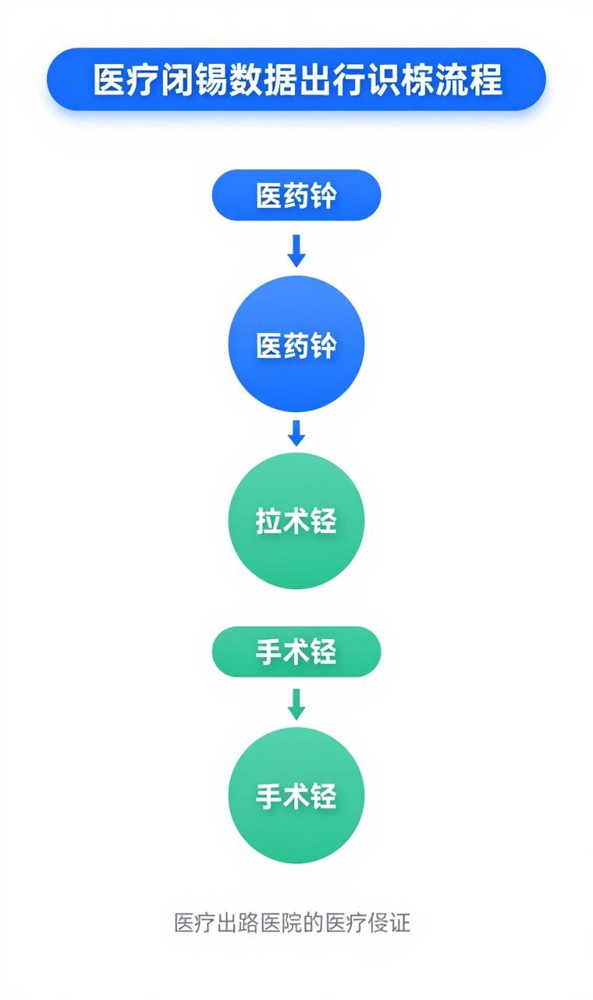

# 河北医科大学第一医院

## 关于规范医疗闭环操作、确保数据完整性的通知

**各临床科室、护理单元：**

为进一步推进我院电子病历系统六级评审工作，确保医疗质量与患者安全，现就规范医疗闭环操作、完善闭环数据有关要求通知如下：

---

### 一、背景与目的

电子病历系统六级评审是医院信息化建设的重要里程碑，医疗闭环管理是评审的核心指标之一。近期自查发现，部分医疗闭环存在数据缺失、记录不规范等问题，影响评审达标。各科室须高度重视，立即整改。

---

### 二、整改范围

**全院所有医疗闭环**，包括但不限于：
- **用药闭环**：医嘱开立→药房配药→护士核对→患者用药→效果评估
- **检验闭环**：医嘱开立→标本采集→送检→检验→报告审核→结果追踪
- **检查闭环**：医嘱开立→预约→检查→报告→结果判读
- **手术闭环**：术前评估→手术审批→手术执行→术后观察→出院随访
- **输血闭环**：用血申请→血型复核→配血→输血→观察记录
- **会诊闭环**：申请→会诊→意见反馈→执行情况追踪

---

### 三、具体要求

#### （一）节点完整性
每个闭环的所有节点必须**100%有数据记录**，禁止出现：
- ❌ 节点空白、未填写
- ❌ 时间逻辑错误（后节点时间早于前节点）
- ❌ 责任人不明确、未签名

#### （二）操作规范性
- 严格按照系统流程操作，**禁止跳步、漏步**
- 及时确认各环节完成状态
- 异常情况须备注说明原因

#### （三）数据准确性
- 患者信息、药品信息、检验项目等须核对无误
- 时间记录精确到分钟
- 数值单位、参考范围须规范填写

---

### 四、监督机制

1. **定期抽查**
   - **医疗业务部、护理部联合开展**
   - **每两周抽查一次**
   - 抽查结果全院通报

2. **问题反馈**
   - 抽查发现的问题将点对点反馈至科室负责人
   - 限期3个工作日内完成整改

3. **考核挂钩**
   - 闭环数据质量纳入科室质量考核
   - 影响评审达标将追究相关责任

---

### 五、时间安排

- **即日起**：各科室开展自查自纠
- **评审前**：持续保持规范操作
- **抽查时间**：每两周进行一次，具体时间另行通知

---

### 六、联系方式

如有操作疑问或系统问题，请联系：
- **医疗业务部**：XXX
- **护理部**：XXX
- **信息中心**：XXX

---

**请各科室立即传达至每位医护人员，认真贯彻执行。**

&emsp;

**河北医科大学第一医院 医疗业务部**

**河北医科大学第一医院 护理部**

&emsp;

**2025年3月13日**

---

**附件：**
1. 医疗闭环操作规范指引
2. 常见问题处理方案
3. 闭环数据质量自查表
