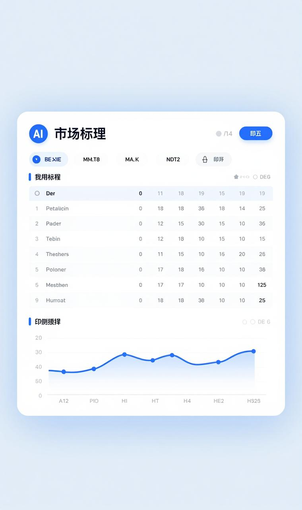

# 会议纪要

## 基本信息

| 项目 | 内容 |
|------|------|
| 会议主题 | 出院智能体推进会 |
| 会议时间 | 2026年3月10日 |
| 会议地点 | （待补充） |
| 记录人 | 逍遥 |

## 参会人员

- **胸外一科**：科室代表
- **智慧医院部**
- **平台工程师**
- **HIS工程师**
- **惠每工程师**

## 会议背景

前期已完成出院智能体的详细需求梳理，并收集了几个科室的前五出院病种指征。本次会议重点针对**胸外一科提供的五个病种出院指征**进行专项沟通确认。

## 会议内容

### 1. 核心议题

针对胸外一科提供的**五个病种出院指征**进行详细确认：
- 惠每工程师与科室代表逐一核对五个病种的具体出院指征
- 明确各病种的判定标准、数据字段、触发条件
- 确认与HIS系统的数据对接要求

### 2. 沟通结果

✅ **已全部搞明白**
- 五个病种的出院指征已与科室达成一致
- 技术实现路径已明确
- 各方职责分工已确认

### 3. 下一步计划

| 事项 | 责任人 | 时间节点 |
|------|--------|---------|
| 制作出院智能体Demo | 惠每工程师 | （待明确） |
| Demo演示与评审 | 全体参会人员 | Demo完成后 |

## 项目状态

🟢 **正常推进**
- 目前进度符合预期
- 与计划无偏移

## 待跟进事项

- [ ] 惠每工程师完成Demo开发
- [ ] 组织Demo评审会议
- [ ] 根据评审结果确定上线计划

## 备注

- 本次沟通为出院智能体项目的**胸外一科试点**阶段
- 待Demo验证通过后，将逐步推广至其他科室

---

**记录时间**：2026-03-10 14:09
